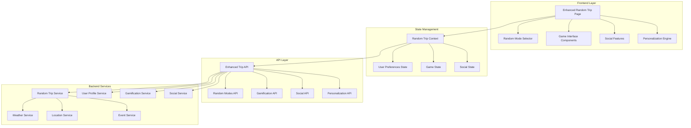
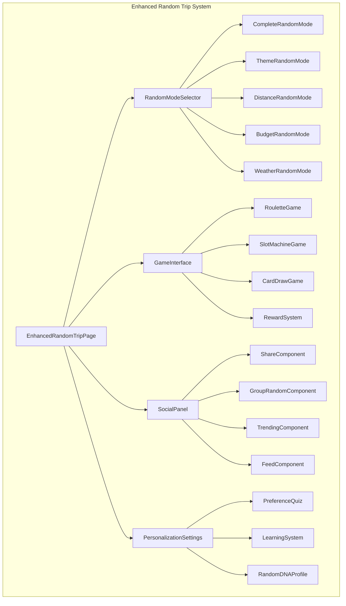

# Enhanced Random Travel System Design

## Overview

Z세대 트렌드에 맞는 강화된 랜덤 여행 추천 시스템을 기존 React + Vite 기반 프로젝트에 통합하여 구현합니다. 현재의 단순한 랜덤 추천을 게임화 요소, 개인화, 소셜 기능이 결합된 종합적인 시스템으로 발전시킵니다.

**기술 스택:**
- Frontend: React 19, Vite, TailwindCSS
- State Management: React Context API + useState/useEffect
- HTTP Client: Axios
- Authentication: JWT
- UI Components: React Icons, Canvas Confetti
- Maps: Google Maps API

## Architecture

### System Architecture



### Component Architecture



## Components and Interfaces

### 1. Core Components

#### EnhancedRandomTripPage
```javascript
// 메인 랜덤 여행 페이지 컴포넌트
const EnhancedRandomTripPage = () => {
  const [selectedMode, setSelectedMode] = useState('complete');
  const [gameType, setGameType] = useState('roulette');
  const [userPreferences, setUserPreferences] = useState({});
  const [gameState, setGameState] = useState({});
  
  // 랜덤 추천 실행
  const executeRandomRecommendation = async (mode, preferences) => {};
  
  // 게임 결과 처리
  const handleGameResult = (result) => {};
  
  return (
    <div className="enhanced-random-trip">
      <RandomModeSelector />
      <GameInterface />
      <SocialPanel />
      <PersonalizationSettings />
    </div>
  );
};
```

#### RandomModeSelector
```javascript
// 다양한 랜덤 모드 선택 컴포넌트
const RandomModeSelector = ({ onModeSelect, selectedMode }) => {
  const modes = [
    { id: 'complete', name: '완전 랜덤', icon: 'FaDice' },
    { id: 'theme', name: '테마 랜덤', icon: 'FaPalette' },
    { id: 'distance', name: '거리 기반', icon: 'FaMapMarkerAlt' },
    { id: 'budget', name: '예산 기반', icon: 'FaWon' },
    { id: 'weather', name: '날씨 기반', icon: 'FaCloudSun' },
    { id: 'instant', name: '지금 당장', icon: 'FaBolt' }
  ];
  
  return (
    <div className="mode-selector-grid">
      {modes.map(mode => (
        <ModeCard key={mode.id} mode={mode} />
      ))}
    </div>
  );
};
```

#### GameInterface
```javascript
// 게임화된 추천 인터페이스
const GameInterface = ({ gameType, onGameComplete }) => {
  const [isPlaying, setIsPlaying] = useState(false);
  const [result, setResult] = useState(null);
  
  const gameComponents = {
    roulette: RouletteGame,
    slot: SlotMachineGame,
    card: CardDrawGame,
    battle: BattleMode
  };
  
  const GameComponent = gameComponents[gameType];
  
  return (
    <div className="game-interface">
      <GameTypeSelector />
      <GameComponent onResult={handleResult} />
      <RewardSystem />
    </div>
  );
};
```

### 2. Game Components

#### RouletteGame
```javascript
// 룰렛 게임 컴포넌트
const RouletteGame = ({ destinations, onResult }) => {
  const [spinning, setSpinning] = useState(false);
  const [rotation, setRotation] = useState(0);
  
  const spinRoulette = () => {
    setSpinning(true);
    const finalRotation = Math.random() * 360 + 1800; // 최소 5바퀴
    setRotation(finalRotation);
    
    setTimeout(() => {
      const selectedIndex = Math.floor((finalRotation % 360) / (360 / destinations.length));
      onResult(destinations[selectedIndex]);
      setSpinning(false);
    }, 3000);
  };
  
  return (
    <div className="roulette-container">
      <div 
        className={`roulette-wheel ${spinning ? 'spinning' : ''}`}
        style={{ transform: `rotate(${rotation}deg)` }}
      >
        {/* 룰렛 섹션들 */}
      </div>
      <button onClick={spinRoulette} disabled={spinning}>
        룰렛 돌리기
      </button>
    </div>
  );
};
```

#### SlotMachineGame
```javascript
// 슬롯머신 게임 컴포넌트
const SlotMachineGame = ({ onResult }) => {
  const [reels, setReels] = useState([[], [], []]);
  const [spinning, setSpinning] = useState(false);
  
  const spinSlots = async () => {
    setSpinning(true);
    
    // 각 릴을 순차적으로 정지
    for (let i = 0; i < 3; i++) {
      await new Promise(resolve => setTimeout(resolve, 1000 + i * 500));
      // 릴 정지 로직
    }
    
    // 결과 계산 및 반환
    const result = calculateSlotResult(reels);
    onResult(result);
    setSpinning(false);
  };
  
  return (
    <div className="slot-machine">
      <div className="reels">
        {reels.map((reel, index) => (
          <ReelComponent key={index} symbols={reel} spinning={spinning} />
        ))}
      </div>
      <button onClick={spinSlots} disabled={spinning}>
        슬롯 돌리기
      </button>
    </div>
  );
};
```

### 3. Social Components

#### ShareComponent
```javascript
// SNS 공유 컴포넌트
const ShareComponent = ({ tripData, userStats }) => {
  const generateShareImage = async (data) => {
    // Canvas를 사용하여 공유용 이미지 생성
    const canvas = document.createElement('canvas');
    const ctx = canvas.getContext('2d');
    
    // 이미지 생성 로직
    return canvas.toDataURL();
  };
  
  const shareToSNS = async (platform) => {
    const shareImage = await generateShareImage(tripData);
    const shareText = `🎲 랜덤 여행 추천받았어요! ${tripData.title}`;
    
    // 플랫폼별 공유 로직
    switch (platform) {
      case 'instagram':
        // Instagram 공유
        break;
      case 'twitter':
        // Twitter 공유
        break;
      case 'kakao':
        // 카카오톡 공유
        break;
    }
  };
  
  return (
    <div className="share-component">
      <div className="share-preview">
        <ShareImagePreview data={tripData} />
      </div>
      <div className="share-buttons">
        <button onClick={() => shareToSNS('instagram')}>Instagram</button>
        <button onClick={() => shareToSNS('twitter')}>Twitter</button>
        <button onClick={() => shareToSNS('kakao')}>KakaoTalk</button>
      </div>
    </div>
  );
};
```

#### GroupRandomComponent
```javascript
// 그룹 랜덤 추천 컴포넌트
const GroupRandomComponent = () => {
  const [groupMembers, setGroupMembers] = useState([]);
  const [groupPreferences, setGroupPreferences] = useState({});
  const [groupResult, setGroupResult] = useState(null);
  
  const createGroup = async (memberEmails) => {
    // 그룹 생성 API 호출
  };
  
  const startGroupRandom = async () => {
    // 그룹 멤버들의 선호도를 종합하여 랜덤 추천
  };
  
  return (
    <div className="group-random">
      <GroupMemberManager />
      <GroupPreferenceAggregator />
      <GroupGameInterface />
    </div>
  );
};
```

### 4. Personalization Components

#### PreferenceQuiz
```javascript
// 사용자 취향 설문 컴포넌트
const PreferenceQuiz = ({ onComplete }) => {
  const [currentQuestion, setCurrentQuestion] = useState(0);
  const [answers, setAnswers] = useState({});
  
  const questions = [
    {
      id: 'travel_style',
      question: '어떤 여행 스타일을 선호하시나요?',
      options: ['액티브', '힐링', '문화탐방', '맛집투어']
    },
    {
      id: 'companion',
      question: '주로 누구와 여행하시나요?',
      options: ['혼자', '연인', '친구', '가족']
    },
    // 추가 질문들...
  ];
  
  const handleAnswer = (answer) => {
    setAnswers(prev => ({
      ...prev,
      [questions[currentQuestion].id]: answer
    }));
    
    if (currentQuestion < questions.length - 1) {
      setCurrentQuestion(prev => prev + 1);
    } else {
      onComplete(answers);
    }
  };
  
  return (
    <div className="preference-quiz">
      <QuestionCard 
        question={questions[currentQuestion]}
        onAnswer={handleAnswer}
      />
      <ProgressBar 
        current={currentQuestion + 1} 
        total={questions.length} 
      />
    </div>
  );
};
```

#### RandomDNAProfile
```javascript
// 사용자 랜덤 DNA 프로필 컴포넌트
const RandomDNAProfile = ({ userStats, preferences }) => {
  const calculateDNA = () => {
    // 사용자의 랜덤 패턴 분석
    const adventureLevel = calculateAdventureLevel(userStats);
    const spontaneityScore = calculateSpontaneityScore(userStats);
    const socialScore = calculateSocialScore(userStats);
    
    return {
      adventureLevel,
      spontaneityScore,
      socialScore,
      dominantTrait: getDominantTrait({ adventureLevel, spontaneityScore, socialScore })
    };
  };
  
  const dna = calculateDNA();
  
  return (
    <div className="random-dna-profile">
      <div className="dna-visualization">
        <DNAChart data={dna} />
      </div>
      <div className="dna-description">
        <h3>당신의 랜덤 DNA: {dna.dominantTrait}</h3>
        <p>모험 지수: {dna.adventureLevel}%</p>
        <p>즉흥성 점수: {dna.spontaneityScore}%</p>
        <p>사교성 점수: {dna.socialScore}%</p>
      </div>
    </div>
  );
};
```

## Data Models

### User Preference Model
```javascript
const UserPreference = {
  userId: String,
  travelStyle: ['active', 'healing', 'culture', 'food'],
  companionType: ['solo', 'couple', 'friends', 'family'],
  budgetRange: { min: Number, max: Number },
  preferredDistance: Number, // km
  favoriteThemes: [String],
  dislikedPlaces: [String],
  timePreferences: {
    morning: Boolean,
    afternoon: Boolean,
    evening: Boolean
  },
  weatherPreferences: [String],
  createdAt: Date,
  updatedAt: Date
};
```

### Game State Model
```javascript
const GameState = {
  userId: String,
  totalPoints: Number,
  level: Number,
  badges: [{
    id: String,
    name: String,
    description: String,
    earnedAt: Date,
    rarity: ['common', 'rare', 'epic', 'legendary']
  }],
  streakCount: Number,
  lastPlayDate: Date,
  achievements: [{
    id: String,
    progress: Number,
    completed: Boolean
  }],
  unlockedFeatures: [String]
};
```

### Random Trip Result Model
```javascript
const RandomTripResult = {
  id: String,
  userId: String,
  mode: String, // 'complete', 'theme', 'distance', etc.
  gameType: String, // 'roulette', 'slot', 'card', etc.
  destination: {
    id: String,
    title: String,
    address: String,
    coordinates: { lat: Number, lng: Number },
    category: String,
    rating: Number,
    imageUrl: String,
    description: String
  },
  metadata: {
    weather: Object,
    events: [Object],
    specialOffers: [Object],
    rarity: String
  },
  createdAt: Date,
  shared: Boolean,
  visited: Boolean,
  rating: Number // 사용자 평가
};
```

### Social Activity Model
```javascript
const SocialActivity = {
  id: String,
  userId: String,
  type: ['share', 'group_random', 'review', 'like'],
  content: {
    tripResult: RandomTripResult,
    text: String,
    images: [String]
  },
  visibility: ['public', 'friends', 'private'],
  likes: Number,
  comments: [{
    userId: String,
    text: String,
    createdAt: Date
  }],
  createdAt: Date
};
```

## Error Handling

### Error Types and Handling Strategy

```javascript
// 에러 타입 정의
const ErrorTypes = {
  NETWORK_ERROR: 'NETWORK_ERROR',
  API_ERROR: 'API_ERROR',
  LOCATION_ERROR: 'LOCATION_ERROR',
  GAME_ERROR: 'GAME_ERROR',
  PREFERENCE_ERROR: 'PREFERENCE_ERROR'
};

// 에러 핸들링 컴포넌트
const ErrorHandler = ({ error, onRetry, onFallback }) => {
  const getErrorMessage = (error) => {
    switch (error.type) {
      case ErrorTypes.NETWORK_ERROR:
        return '네트워크 연결을 확인해주세요.';
      case ErrorTypes.LOCATION_ERROR:
        return '위치 정보를 가져올 수 없습니다.';
      case ErrorTypes.GAME_ERROR:
        return '게임 실행 중 오류가 발생했습니다.';
      default:
        return '알 수 없는 오류가 발생했습니다.';
    }
  };
  
  return (
    <div className="error-container">
      <p>{getErrorMessage(error)}</p>
      <div className="error-actions">
        <button onClick={onRetry}>다시 시도</button>
        <button onClick={onFallback}>기본 모드로 전환</button>
      </div>
    </div>
  );
};
```

### Fallback Strategies

1. **네트워크 오류**: 캐시된 데이터 사용 또는 오프라인 모드
2. **위치 오류**: 수동 지역 선택 옵션 제공
3. **게임 오류**: 기본 랜덤 추천으로 폴백
4. **API 오류**: 로컬 데이터베이스 또는 정적 데이터 사용

## Testing Strategy

### Unit Testing
- 각 게임 컴포넌트의 로직 테스트
- 개인화 알고리즘 테스트
- 데이터 모델 검증 테스트

### Integration Testing
- API 연동 테스트
- 상태 관리 플로우 테스트
- 사용자 인터랙션 시나리오 테스트

### E2E Testing
- 전체 랜덤 추천 플로우 테스트
- 소셜 기능 통합 테스트
- 게임화 시스템 테스트

### Performance Testing
- 게임 애니메이션 성능 테스트
- 대용량 데이터 처리 테스트
- 모바일 환경 최적화 테스트

## Implementation Phases

### Phase 1: Core Random Modes (2주)
- 기본 랜덤 모드 구현 (완전, 테마, 거리, 예산, 날씨)
- 기존 RandomTrip 컴포넌트 확장
- 기본 UI/UX 개선

### Phase 2: Game Interface (2주)
- 룰렛, 슬롯머신, 카드 뽑기 게임 구현
- 애니메이션 및 사운드 효과
- 보상 시스템 기초 구현

### Phase 3: Personalization (1.5주)
- 사용자 취향 설문 시스템
- 학습 알고리즘 구현
- 랜덤 DNA 프로필 생성

### Phase 4: Social Features (2주)
- SNS 공유 기능
- 그룹 랜덤 시스템
- 피드 및 트렌딩 기능

### Phase 5: Advanced Features (1.5주)
- 실시간 이벤트 연동
- 고급 게임화 요소
- 성능 최적화 및 테스트